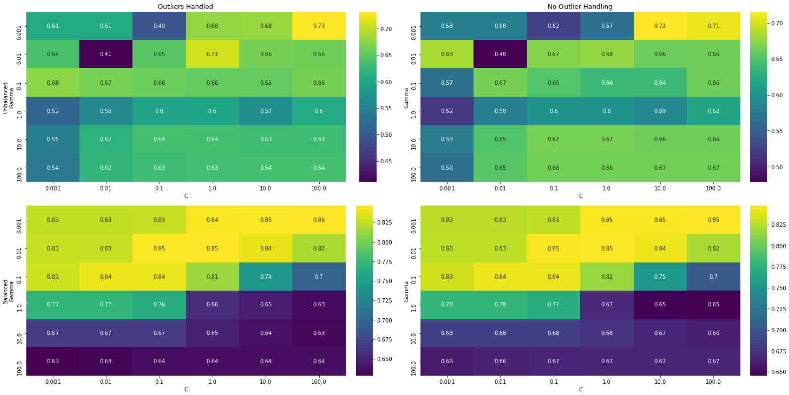
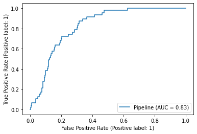
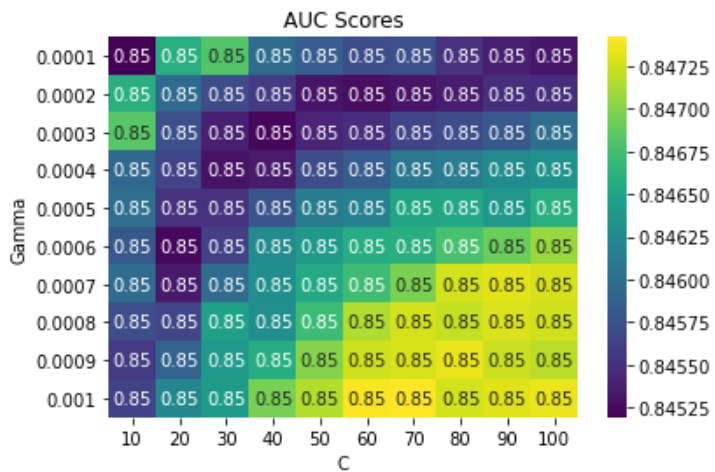
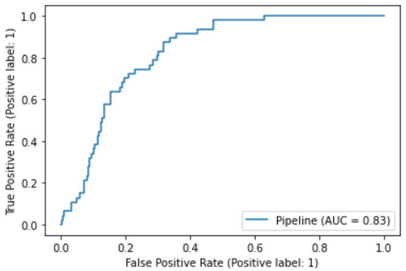
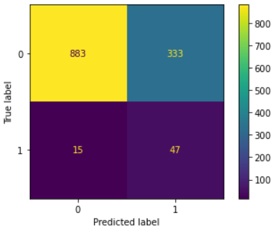
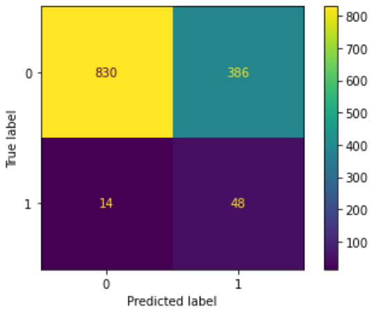
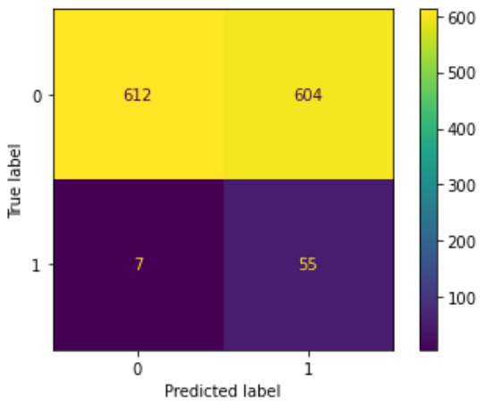

# StrokePrediction
This project deploys a Machine Learning model to predict individuals' risk of experiencing a stroke based on 
personal health & demographic data. The training data was downloaded from 
[Kaggle](https://www.kaggle.com/datasets/fedesoriano/stroke-prediction-dataset). The model was trained and 
tested using Python's [scikit-learn](https://scikit-learn.org/stable/) package. The model is deployed using Python's [Flask](https://flask.palletsprojects.com/en/2.3.x/) framework and hosted on [AWS](https://aws.amazon.com/).

# Exploratory Data Analysis 📊
The data was first split into training & test sets using a stratified sampling technique due to the heavy class skew 
present in the data (positive samples made up just under 5% of the total samples). The data was then explored using 
techniques as seen in the Jupyter Notebook found here: [Notebooks/eda.ipynb](Notebooks/eda.ipynb). In addition to identifying 
the heavy class skew, the EDA process also revelaed that:

- The training set contained outliers in the Average Glucose Level and BMI features
- The training set had 158 samples with missing values for the BMI feature

These findings were taken into consideration in the training of the model.

# Model Training 🏋️‍♀️
The methods used to train the model can be found in [Notebooks/training.ipynb](Notebooks/training.ipynb).

## Preprocessing ⚙️
Due to the outliers discovered during EDA, an `OutlierHandler` class was defined to cap any samples beneath the 
lower threshold for a given feature at the lower threshold and any samples above the upper threshold for the given 
feature at the upper threshold.

The following transformers were also used in the data preprocessing:

- `OneHotEncoder` to be used on the categorical features (`gender`, `work_type`, `Residence_type`, `smoking_status`)
- `OrdinalEncoder` to transfrom `Yes/No` values into binary `1/0` values in the feature `ever_married`
- `KNNImputer` for imputing missing values for the `BMI` feature (or any other numerical feature with missing values)
- `StandardScaler` for standardizing the features `age`, `avg_glucose_level`, and `bmi`

The above transformers were combined into a preprocessing pipeline as follows:

1. Pipeline(`OneHotEncoder`, `OrdinalEncoder`, `KNNImputer`, `OutlierHandler`, `StandardScaler`)

## Model Evaluation 🔍
To evaluate model performance, the training set was split further into a training and validation set.

Scikit-Learn's Support Vector Classifier ([SVC](https://scikit-learn.org/stable/modules/generated/sklearn.svm.SVC.html#sklearn.svm.SVC)) 
was chosen as the model to use due to its versatility, memory-efficient algorithm, and its compatability with the data. A 5-fold 
cross-validated grid search was performed using the pipeline described above and the following parameter grid:

- SVC parameters
  - `C`: [0.001, 0.01, 0.1, 1, 10, 100]
  - `Gamma`: [0.001, 0.01, 0.1, 1, 10, 100]
  - `Class Weight`: [None, 'balanced']
- `OutlierHandler`: Use or Omit

The ROC AUC was used as the metric for scoring model performance.

The results were displayed in a heatmap and the optimal parameter combination was identified as:

- `C`: 100
- `Gamma`: 0.001
- `Class Weight`: 'balanced'
- `Outlier Handler`: omitted

This combination of parameters produced an AUC of 0.83 when tested on the validation set.

Another 'zoomed-in' grid search was performed, testing the combination of the following SVC parameters:

- `C`: [10, 20, 30, 40, 50, 60, 70, 80, 90, 100]
- `Gamma`: [0.0001, 0.0002, 0.0003, 0.0004, 0.0005, 0.0006, 0.0007, 0.0008, 0.0009, 0.001]

`Class Weight` and the use of `OutlierHandler` were held constant at 'balanced' and omitted, respectively. Results were once 
again displayed in a heatmap and the optimal parameter combination was tested on the validation set. However, results did 
not differ much from the original grid search, so the parameter combination that was originally identified as optimal was 
chosen for use in the final model.

## Results ☑️
Due to the nature of the problem being addressed (predicting stroke events for individuals), it was determined that Recall 
should be the metric against which final model performance would be evaluated. The reasoning being that we would rather misclassify 
an individual as high risk for having a stroke, resulting in further evaluation and/or preventative measures being taken that in 
reality are probably not necessary, as opposed to misclassifying an individual as low risk for having a stroke, and then a stroke 
event occurs that perhaps could have been prevented had further evaluation or preventative measures been taken.

After fitting the model on the full training set, the model was evaluated against the test set. For reference, the AUC score was 
computed and returned a result of 0.81 (slightly worse than the AUC of 0.83 returned on the validation set). Recall was computed 
using 3 different thresholds for making a decision with the model's decision function (if the decision function returns a value 
greater than the given threshold, then the positive class is predicted, otherwise the negative class is predicted):

1. Default threshold of 0.0
2. Threshold found using [Youden's J Statistic](https://en.wikipedia.org/wiki/Youden%27s_J_statistic). This finds the threshold that
   maximizes the difference between the true-positive rate and the false-positive rate, as displayed on the ROC curve (Threshold: -0.18)
3. Threshold that results in the max true-positive rate within an acceptable range of false-positive rates (acceptable range of false
   positives was set as between 0.4 & 0.5; Threshold: -0.89)

The confusion matrices and recall scores for each of the thresholds are displayed below.

  
**Recall: 75.81%**

  
**Recall: 77.42%**

  
**Recall: 88.71%**

# Deployment ⏯️
The final model was saved as a [pickle](https://docs.python.org/3/library/pickle.html) object in 
[Notebooks/final_model.ipynb](Notebooks/final_model.ipynb). To deploy the model, a Flask application was 
built, allowing end users to input their health & demographic info and then receive a prediction of their 
risk level to experience a stroke.

The Flask application is hosted using [AWS Elastic Beanstalk](https://aws.amazon.com/elasticbeanstalk/). You can 
find the source code for the application in [src/](src/).
